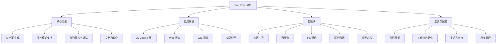
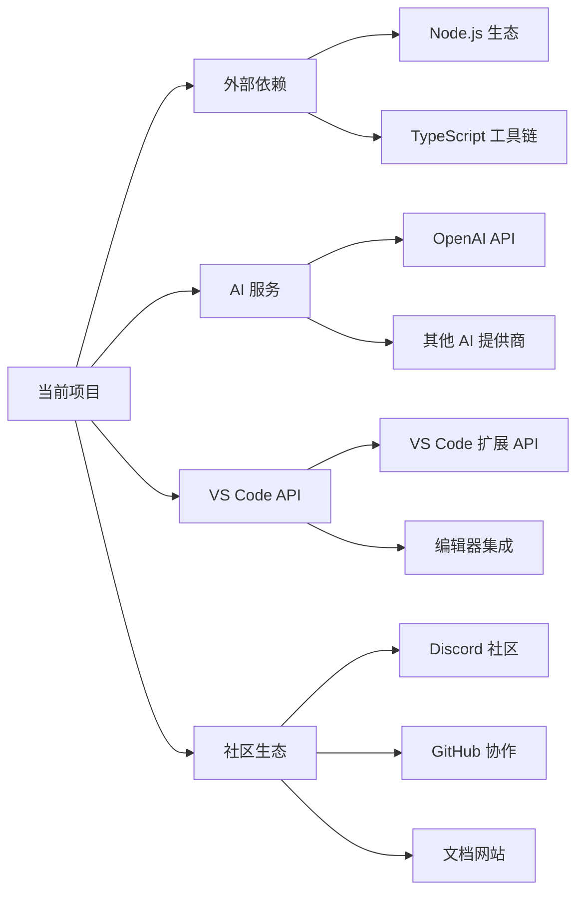

# Roo Code 项目知识图谱

> [!abstract] 项目概览
> Roo Code 是一个 AI 驱动的开发团队工具，直接集成在编辑器中。这是一个 VS Code 扩展项目，使用现代 TypeScript 技术栈构建。

## 核心架构

## 关键节点详情

### 核心功能节点

- **AI 代码生成**：从自然语言描述生成代码
- **多种模式**：代码模式、架构模式、问答模式、调试模式、自定义模式
- **代码重构**：自动化代码优化和重构
- **文档自动化**：自动生成和更新文档

### 应用模块节点

- **VS Code 扩展**：主要编辑器集成
- **Web 版本**：基于浏览器的版本
- **E2E 测试**：端到端测试套件
- **夜间构建**：持续集成测试版本

### 包模块节点

- **构建工具**：项目构建和打包
- **云服务**：后端服务集成
- **IPC 通信**：进程间通信机制
- **遥测数据**：使用数据收集和分析
- **类型定义**：TypeScript 类型系统

### 工具与配置节点

- **代码质量**：ESLint、Prettier 配置
- **工作流自动化**：Turbo、GitHub Actions
- **多语言支持**：20+ 语言本地化
- **发布管理**：Changeset、版本控制

## 技术栈特征

> [!note] 技术特征
>
> - **语言**：TypeScript 为主
> - **构建**：Turbo、Vite
> - **包管理**：PNPM Workspaces
> - **测试**：Vitest、Playwright
> - **代码质量**：ESLint、Prettier、Knip
> - **CI/CD**：GitHub Actions、Changesets

## 项目结构提示

> [!tip] 探索建议
> 要深入了解项目细节，可以：
>
> 1. 查看 `apps/vscode/` - VS Code 扩展实现
> 2. 查看 `packages/` - 共享模块和工具
> 3. 查看 `.roo/` - Roo 特定配置和规则
> 4. 查看 `locales/` - 多语言支持文件

## 隐藏的复杂性

> [!warning] 细节隐藏
> 此图谱隐藏了以下细节：
>
> - 具体的 API 实现和集成
> - AI 模型调用逻辑
> - 复杂的配置文件和脚本
> - 详细的测试用例和场景
> - 性能优化和缓存策略

## 扩展连接

## 总结

Roo Code 是一个**现代化、模块化、可扩展**的 AI 编码助手项目，具有：

- 清晰的**架构分层**
- 完善的**工具链支持**
- 强大的**多语言能力**
- 活跃的**社区生态**

> [!success] 探索完成
> 此图谱提供了项目的高层概览，隐藏了实现细节但保留了架构脉络。如需深入了解特定模块，请查看对应的源代码目录。
