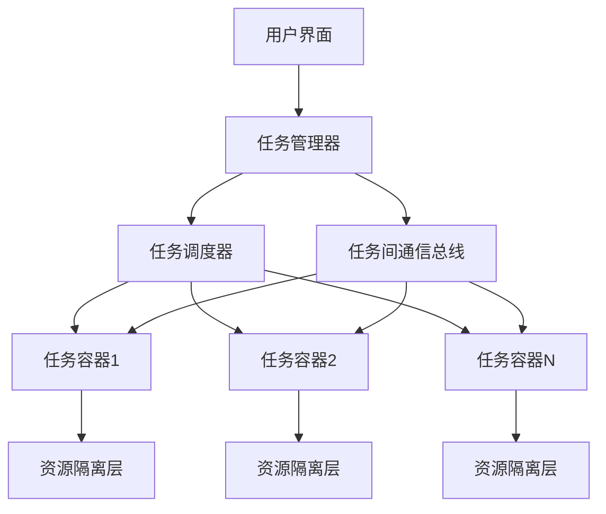

# 多任务容器 - 最终版设计

## 概述

本文档提供了Roo Code多任务容器的最终版设计方案。该设计支持多个任务并发运行，任务间可以相互发送任务并等待完成，每个任务有独立的资源隔离和API配置。

## 设计目标

1. **多任务并发**：支持多个任务同时运行，由任务调度器管理并发数量
2. **任务间通信**：一个任务可以向另一个任务发送"提问"并等待完成
3. **资源隔离**：每个任务有独立的文件操作上下文和API配置
4. **文件限制**：每个任务有固定的可写文件集合（除初次分配外只能手动更改）
5. **任务管理界面**：提供任务列表视图和任务详情视图

## 系统架构

### 核心组件



### 组件说明

1. **任务调度器 (TaskScheduler)**

    - 管理最大并发任务数（默认3个）
    - 维护活跃任务队列和等待队列
    - 处理任务生命周期事件
    - 提供资源锁机制防止冲突

2. **任务管理器 (TaskManager)**

    - 替代原有的`clineStack`数组
    - 使用`Map<string, Task>`管理所有任务
    - 提供任务创建、查找、删除接口
    - 维护任务状态和元数据

3. **任务间通信总线 (TaskCommunicationBus)**

    - 基于事件系统的消息传递机制
    - 支持任务到任务的直接消息
    - 提供请求-响应模式
    - 处理任务完成通知

4. **任务容器 (TaskContainer)**

    - 每个任务独立的运行环境
    - 包含资源隔离层
    - 管理任务特定的文件操作上下文
    - 维护独立的API配置

5. **资源隔离层 (ResourceIsolationLayer)**
    - 文件操作沙箱：限制可写文件范围
    - API配置隔离：每个任务独立的提供商配置
    - 上下文隔离：防止任务间状态污染

## 详细设计

### 1. 任务调度器增强

现有的`TaskScheduler`类需要增强以支持任务间依赖：

```typescript
interface TaskDependency {
	sourceTaskId: string
	targetTaskId: string
	type: "wait_for_completion" | "data_dependency"
	status: "pending" | "fulfilled" | "failed"
}

class EnhancedTaskScheduler extends TaskScheduler {
	private taskDependencies: Map<string, TaskDependency[]> = new Map()

	async scheduleTaskWithDependency(task: Task, dependsOn?: string[]): Promise<void> {
		// 检查依赖任务是否存在且已完成
		if (dependsOn && dependsOn.length > 0) {
			const dependency = {
				sourceTaskId: task.taskId,
				targetTaskId: dependsOn[0],
				type: "wait_for_completion",
				status: "pending",
			}
			this.addDependency(dependency)

			// 等待依赖任务完成
			await this.waitForDependency(dependency)
		}

		await this.scheduleTask(task)
	}

	private async waitForDependency(dependency: TaskDependency): Promise<void> {
		return new Promise((resolve) => {
			const checkCompletion = () => {
				const targetTask = this.activeTasks.get(dependency.targetTaskId)
				if (!targetTask && !this.taskQueue.some((t) => t.taskId === dependency.targetTaskId)) {
					// 任务已完成或不存在
					dependency.status = "fulfilled"
					resolve()
				}
			}

			// 定期检查或通过事件监听
			const interval = setInterval(checkCompletion, 100)
			checkCompletion() // 立即检查一次

			// 清理
			setTimeout(() => {
				clearInterval(interval)
				if (dependency.status === "pending") {
					dependency.status = "failed"
					resolve()
				}
			}, 30000) // 30秒超时
		})
	}
}
```

### 2. 任务间通信协议

定义任务间消息格式：

```typescript
interface TaskMessage {
	id: string
	timestamp: number
	fromTaskId: string
	toTaskId: string
	type: "task_request" | "task_response" | "task_completion"
	payload: {
		requestType: "execute_task" | "query_status" | "transfer_data"
		mode?: string // 目标模式（如'architect', 'code'等）
		message: string // 任务描述/提问
		context?: {
			allowedFiles?: string[] // 允许操作的文件列表
			apiConfiguration?: any // API配置
			parentTaskId?: string // 父任务ID
		}
		metadata?: Record<string, any>
	}
	response?: {
		taskId?: string // 创建的任务ID
		status?: "accepted" | "rejected" | "completed"
		result?: any // 任务结果
		error?: string // 错误信息
	}
}

interface TaskCompletionNotification {
	taskId: string
	status: "completed" | "failed" | "cancelled"
	result?: any
	tokenUsage?: TokenUsage
	toolUsage?: ToolUsage
	timestamp: number
}
```

### 3. 任务等待机制

发送方任务等待接收方任务完成的实现：

```typescript
class TaskWithWaitSupport extends Task {
  private pendingRequests: Map<string, {
    promise: Promise<any>
    resolve: (value: any) => void
    reject: (reason: any) => void
    timeout: NodeJS.Timeout
  }> = new Map()

  /**
   * 向另一个任务发送请求并等待完成
   */
  async sendTaskAndWait(
    targetTaskId: string,
    request: Omit<TaskMessage['payload'], 'requestType'>
  ): Promise<any> {
    const messageId = generateMessageId()

    const message: TaskMessage = {
      id: messageId,
      timestamp: Date.now(),
      fromTaskId: this.taskId,
      toTaskId: targetTaskId,
      type: 'task_request',
      payload: {
        requestType: 'execute_task',
        ...request
      }
    }

    // 创建Promise用于等待响应
    const promise = new Promise<any>((resolve, reject) => {
      const timeout = setTimeout(() => {
        this.pendingRequests.delete(messageId)
        reject(new Error(`等待任务响应超时: ${targetTaskId}`))
      }, 300000) // 5分钟超时

      this.pendingRequests.set(messageId, {
        promise,
        resolve,
        reject,
        timeout
      })
    })

    // 发送消息
    await this.sendTaskMessage(message)

    return promise
  }

  /**
   * 处理任务完成通知
   */
  private handleTaskCompletion(notification: TaskCompletionNotification): void {
    // 查找所有等待该任务完成的请求
    for (const [messageId, request] of this.pendingRequests.entries()) {
      // 这里需要根据消息内容匹配任务ID
      // 简化实现：假设我们记录了哪个消息ID对应哪个任务ID
      if (notification.taskId === /* 对应的目标任务ID */) {
        clearTimeout(request.timeout)
        if (notification.status === 'completed') {
          request.resolve(notification.result)
        } else {
          request.reject(new Error(`任务失败: ${notification.error || notification.status}`))
        }
        this.pendingRequests.delete(messageId)
      }
    }
  }
}
```

### 4. 文件限制机制

每个任务有固定的可写文件集合：

```typescript
class RestrictedFileSystem {
	private allowedFiles: Set<string> = new Set()
	private allowedPatterns: string[] = []
	private taskId: string

	constructor(taskId: string, initialFiles: string[] = []) {
		this.taskId = taskId
		this.allowedFiles = new Set(initialFiles.map((f) => path.resolve(f)))
	}

	/**
	 * 检查文件是否允许写入
	 */
	canWrite(filePath: string): boolean {
		const resolvedPath = path.resolve(filePath)

		// 检查精确匹配
		if (this.allowedFiles.has(resolvedPath)) {
			return true
		}

		// 检查模式匹配
		for (const pattern of this.allowedPatterns) {
			if (minimatch(resolvedPath, pattern)) {
				return true
			}
		}

		return false
	}

	/**
	 * 添加允许的文件（仅限手动更改）
	 */
	addAllowedFile(filePath: string, requireManualApproval: boolean = true): boolean {
		if (requireManualApproval) {
			// 需要用户手动批准
			// 在实际实现中，这里会触发用户确认对话框
			console.log(`需要手动批准添加文件: ${filePath}`)
			return false
		}

		const resolvedPath = path.resolve(filePath)
		this.allowedFiles.add(resolvedPath)
		return true
	}

	/**
	 * 获取所有允许的文件
	 */
	getAllowedFiles(): string[] {
		return Array.from(this.allowedFiles)
	}
}
```

### 5. 多窗口管理界面

#### 任务列表视图

```
+-----------------------------------+
| 任务管理器                        |
+-----------------------------------+
| [新建任务] [刷新] [设置]          |
+-----------------------------------+
| ID         | 状态    | 模式   | 操作 |
|------------|---------|--------|------|
| task-001   | 运行中  | 架构师 | [查看] [发送] |
| task-002   | 等待中  | 代码   | [查看] [取消] |
| task-003   | 已完成  | 测试   | [查看] [删除] |
| task-004   | 失败    | 调试   | [查看] [重试] |
+-----------------------------------+
```

#### 任务详情视图

```
+-----------------------------------+
| 任务详情 - task-001               |
+-----------------------------------+
| 模式: 架构师                      |
| 状态: 运行中                      |
| 创建时间: 2024-01-15 10:30:00    |
| 允许的文件:                       |
|   - /src/components/Button.tsx    |
|   - /src/styles/theme.css         |
+-----------------------------------+
| [发送任务到...] [暂停] [取消]     |
+-----------------------------------+
| 聊天历史:                         |
| 用户: 设计一个登录组件            |
| AI: 正在分析需求...               |
+-----------------------------------+
```

## 实现路径

### 第一阶段：基础架构升级

1. 重构`ClineProvider`，将`clineStack`迁移到`TaskManager`
2. 增强`TaskScheduler`支持任务依赖
3. 实现基本的任务间通信总线

### 第二阶段：资源隔离

1. 实现`RestrictedFileSystem`文件限制机制
2. 增强`Task`类支持独立的API配置
3. 添加任务资源清理机制

### 第三阶段：用户界面

1. 创建任务管理器Webview组件
2. 实现任务列表和详情视图
3. 添加任务创建和发送界面

### 第四阶段：高级功能

1. 实现任务等待和同步机制
2. 添加任务结果传递功能
3. 实现任务模板和批量操作

## API设计

### 扩展Webview消息类型

```typescript
// 在WebviewMessage类型中添加
type WebviewMessage =
	| { type: "createMultiTask"; mode: string; message: string; targetTaskId?: string }
	| { type: "sendTaskToWindow"; fromTaskId: string; toTaskId: string; message: string }
	| { type: "taskCompleted"; taskId: string; result: any }
	| { type: "getTaskList" }
	| { type: "taskList"; tasks: TaskInfo[] }
	| { type: "switchToTask"; taskId: string }
	| { type: "updateTaskFiles"; taskId: string; files: string[] }

interface TaskInfo {
	id: string
	status: "running" | "waiting" | "completed" | "failed"
	mode: string
	title?: string
	createdAt: number
	updatedAt: number
	allowedFiles: string[]
	parentTaskId?: string
	childTaskIds: string[]
}
```

### 新的工具函数

```typescript
// 发送任务到其他窗口的工具
async function sendTaskToWindowTool(
	task: Task,
	block: ToolUse,
	askApproval: AskApproval,
	handleError: HandleError,
	pushToolResult: PushToolResult,
) {
	const targetTaskId = block.params.targetTaskId
	const message = block.params.message

	if (!targetTaskId || !message) {
		pushToolResult(formatResponse.toolError("缺少必要参数: targetTaskId 或 message"))
		return
	}

	// 发送任务请求
	const result = await task.sendTaskAndWait(targetTaskId, {
		mode: task.mode, // 使用当前模式或指定模式
		message,
		context: {
			allowedFiles: task.getAllowedFiles(),
			apiConfiguration: task.apiConfiguration,
		},
	})

	pushToolResult(formatResponse.toolSuccess(`任务已发送到 ${targetTaskId}，结果: ${JSON.stringify(result)}`))
}
```

## 并发控制与资源管理

### 资源限制

- 最大并发任务数：可配置，默认3个
- 每个任务最大内存使用：监控和限制
- 文件操作频率限制：防止DoS攻击
- API调用速率限制：全局和每个任务独立

### 错误处理

1. **任务失败恢复**：记录失败原因，提供重试机制
2. **资源泄漏预防**：任务完成后自动清理资源
3. **死锁检测**：监控任务依赖循环
4. **超时处理**：所有操作都有超时机制

## 测试策略

### 单元测试

1. 任务调度器并发测试
2. 任务间通信协议测试
3. 文件限制机制测试
4. 资源隔离测试

### 集成测试

1. 多任务场景测试
2. 任务依赖和等待测试
3. 用户界面交互测试
4. 错误恢复测试

### 性能测试

1. 并发任务压力测试
2. 内存泄漏测试
3. 大规模任务管理测试

## 迁移计划

### 向后兼容性

1. 保持现有单任务API不变
2. 逐步迁移到多任务架构
3. 提供兼容层支持旧代码

### 数据迁移

1. 现有任务历史迁移到新格式
2. 用户设置迁移
3. 文件权限配置迁移

## 总结

本设计提供了一个完整的多任务容器解决方案，支持：

- 多个任务并发运行
- 任务间通信和任务发送
- 资源隔离和文件限制
- 直观的任务管理界面
- 健壮的错误处理和恢复机制

该设计基于现有Roo Code架构，最大限度地重用现有组件，同时提供清晰的扩展路径。

---

_文档版本: 1.0_
_最后更新: 2024-01-15_
_设计者: Roo Code 架构团队_
